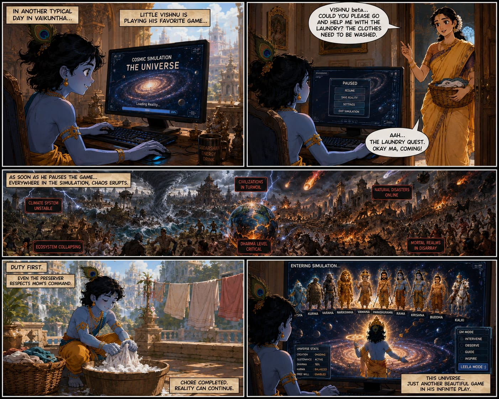

# Leela.exe Production System

Long-form mythology manga/anime production workspace for the Vishnu/Dashavatar story system.
 


## Project Identity

Leela.exe is a mythology-based cinematic universe and production pipeline. The core premise is fixed:

- the universe is a sacred simulation engine
- child Vishnu maintains it from Vaikuntha
- each Dashavatar is an intervention protocol when Dharma destabilizes

The workspace is also designed as an AI/ML production system where approved pages, reviews, prompts, continuity memory, and model/dataset metadata can later become training and evaluation material.

## Production Priorities

1. Continuity first.
2. Lore consistency.
3. Recurring visual identity.
4. Emotional coherence.
5. Chapter-level pacing.
6. Modular long-term scalability.
7. Automation readiness.
8. AI/ML dataset and model lineage.

## Series Format

- 10 chapters total.
- One avatar focus per chapter.
- 10 pages per chapter.
- Each chapter must complete its avatar storyline within those 10 pages.

## Folder Map

```text
project vishnu/
  animation_notes/     Cinematic language and animation guidance
  assets/              Incoming, approved, reference, and rejected visual assets
  automation/          Pipeline manifests, runtime state, schemas, command registry
  chapters/            Chapter plans, page blueprints, prompts, and reviews
  characters/          Character identity and continuity sheets
  continuity/          Series memory, chapter memory, rules, architecture
  docs/                Engineering strategy, roadmap, production foundation
  lore/                Avatar system, Dharma engine, universe rules
  prompts/             Reusable generation templates
  qa/                  Continuity, mythology, and visual drift checklists
  references/          Reference index
  style/               Art direction, color language, panel rules
  templates/           Reusable markdown/YAML templates
  workflows/           Operational production workflows
```

## Core Working Layers

### Canon Layer

- `lore/`
- `characters/`
- `style/`

Use this layer for durable truth: how the universe works, who recurring characters are, what visual language is locked, and what cannot drift between pages.

### Runtime Memory Layer

- `continuity/series_memory.md`
- `continuity/chapter_memory.md`
- `continuity/continuity_rules.md`
- `continuity/memory_architecture.md`

Use this layer to track what has already happened, what changed, what must be preserved, and what future pages need to remember.

### Production Layer

- `chapters/`
- `prompts/`
- `assets/`
- `animation_notes/`
- `qa/`
- `workflows/`

Use this layer to produce pages, review continuity, generate prompts, approve assets, and package chapter work.

### Automation And AI/ML Layer

- `automation/`
- `templates/dataset_manifest_template.yaml`
- `templates/model_card_template.md`
- `docs/ai_ml_engineering_strategy.md`
- `docs/future_roadmap.md`

Use this layer to make the project machine-readable and ready for future dataset, model, evaluation, and pipeline work.

## Current Chapter State

Active production is focused on Chapter 01: Matsya.

Important files:

- `chapters/chapter_01_matsya/chapter_plan.md`
- `chapters/chapter_01_matsya/pages/page_01_blueprint.md`
- `chapters/chapter_01_matsya/pages/page_02_blueprint.md`
- `chapters/chapter_01_matsya/prompts/page_02_generation_packet.md`
- `chapters/chapter_01_matsya/reviews/page_01_review.md`
- `chapters/chapter_01_matsya/reviews/page_02_review.md`

The canonical approved page image currently lives at:

```text
assets/approved/pages/chapter_01_page_01.png
```

## Standard Page Workflow

1. Read `continuity/series_memory.md`.
2. Read `continuity/chapter_memory.md`.
3. Check relevant lore, character, and style files.
4. Draft or update the page blueprint in `chapters/.../pages/`.
5. Generate the page prompt from `prompts/page_generation_template.md`.
6. Place generated assets in `assets/incoming/`.
7. Review with `qa/continuity_checklist.md`, `qa/visual_drift_checklist.md`, and `qa/mythology_integrity_checklist.md`.
8. Move approved outputs to `assets/approved/`.
9. Update continuity memory.

## Documentation Entry Points

- Start with `docs/production_foundation.md` for production principles.
- Use `docs/future_roadmap.md` for planned growth.
- Use `docs/ai_ml_engineering_strategy.md` for training/evaluation direction.
- Use `learn.md` as the broad learning and context document.

## Rules

- Do not treat generated art as canon until it passes review.
- Do not overwrite continuity memory without recording why.
- Do not let page-level style decisions contradict locked character, lore, or panel rules.
- Keep source references and approved outputs distinct from incoming experiments.
- Treat AI/ML artifacts as lineage-controlled production material, not loose files.
